### Hotel Management System
Design and implement a Hotel Management System that manages hotel rooms, reservations, and guest information. The system should handle room bookings, check-ins, check-outs, and maintain room status.

#### 1. Requirement Gathering

- Functional Requirement
  - The hotel management system should allow guests to book rooms, check-in, and check-out.
  - The system should manage different types of rooms, such as single, double, deluxe, and suite.
  - The system should handle room availability and reservation status.
  - The system should allow the hotel staff to manage guest information, room assignments, and billing.
  - The system should support multiple payment methods, such as cash, credit card, and online payment.
- Non-Functional Requirement
  - The system should handle concurrent bookings and ensure data consistency. 
  - The system should provide reporting and analytics features for hotel management. 
  - The system should be scalable and handle a large number of rooms and guests.

#### 2. Core Identity
- HotelManagementFacade - class
  - contains services class reference for room, booking and payment services
  - supports high level operations with hotel which are `bookRoom`, `checkIn`, `checkOut` etc
- RoomService - class
  - have list of `rooms`, supports all room operations such as addRoom, findRoom, findRoomByNumber
- PaymentService - class
  - have supported method for payment to process it
- BookingService - class
  - responsible for maintaining list of Booking, and the observables to notify them
- BookingStatus - enum
  - REQUESTED, CONFIRMED, CHECKED_IN, CHECKED_OUT, CANCELLED
- RoomStyle - enum
  - STANDARD, DELUXE, OCEAN_VIEW
- RoomType - enum
  - SINGLE, DOUBLE, SUITE
- Bookable - interface - decorator
  - RoomBooking - class
  - AmenityDecorator - abstract class
    - SpaDecorator
    - BreakfastDecorator
- RoomFactory - class
  - createRoom based on different types of room
- BookingObserver - interface
  - EmailNotifier
  - SMSNotifier
- Payment - interface
  - CreditCardPayment
  - CashPayment
- Specification pattern for RoomType, RoomAvailable, RoomStyle etc
- State pattern
  - AvailableState, MaintenanceState, OccupiedState etc

#### 3. Design class & relationships (Code Impl, Run & Test)

```mermaid
classDiagram
    %% Enums
    class BookingStatus {
        <<enumeration>>
        REQUESTED
        CONFIRMED
        CHECKED_IN
        CHECKED_OUT
        CANCELLED
    }
    class RoomStyle {
        <<enumeration>>
        STANDARD
        DELUXE
        OCEAN_VIEW
    }
    class RoomType {
        <<enumeration>>
        SINGLE
        DOUBLE
        SUITE
    }

    %% Facade Pattern
    class HotelManagementFacade {
        -RoomService roomService
        -BookingService bookingService
        -PaymentService paymentService
        +bookRoom(RoomSpecification spec, Customer customer) Booking
        +checkIn(String bookingId) boolean
        +checkOut(String bookingId) boolean
    }

    %% Service Layer
    class RoomService {
        -List~Room~ rooms
        +addRoom(Room room)
        +findRoom(RoomSpecification spec) List~Room~
        +findRoomByNumber(String number) Room
    }
    class BookingService {
        -List~Booking~ bookings
        -List~BookingObserver~ observers
        +addObserver(BookingObserver o)
        +removeObserver(BookingObserver o)
        +notifyObservers(Booking b)
        +createBooking(Bookable item) Booking
        +updateBookingStatus(String bookingId, BookingStatus status)
    }
    class PaymentService {
        +processPayment(Payment paymentStrategy, double amount) boolean
    }

    %% Core Entities
    class Room {
        -String roomNumber
        -RoomType type
        -RoomStyle style
        -RoomState state
        +setState(RoomState state)
        +book()
        +checkIn()
        +checkOut()
        +markMaintenance()
    }
    class Booking {
        -String bookingId
        -Bookable bookedItem
        -BookingStatus status
        +setStatus(BookingStatus status)
    }

    %% Factory Pattern
    class RoomFactory {
        +createRoom(String roomNumber, RoomType type, RoomStyle style) Room
    }

    %% State Pattern (Room Status)
    class RoomState {
        <<interface>>
        +book(Room room)
        +checkIn(Room room)
        +checkOut(Room room)
        +markMaintenance(Room room)
    }
    class AvailableState { }
    class OccupiedState { }
    class MaintenanceState { }

    RoomState <|.. AvailableState
    RoomState <|.. OccupiedState
    RoomState <|.. MaintenanceState
    Room o-- RoomState

    %% Decorator Pattern (Pricing & Amenities)
    class Bookable {
        <<interface>>
        +getDescription() String
        +getCost() double
    }
    class RoomBooking {
        -Room room
        +getDescription() String
        +getCost() double
    }
    class AmenityDecorator {
        <<abstract>>
        #Bookable wrappedItem
        +getDescription() String
        +getCost() double
    }
    class SpaDecorator { }
    class BreakfastDecorator { }

    Bookable <|.. RoomBooking
    Bookable <|.. AmenityDecorator
    AmenityDecorator o-- Bookable
    AmenityDecorator <|-- SpaDecorator
    AmenityDecorator <|-- BreakfastDecorator

    %% Observer Pattern (Notifications)
    class BookingObserver {
        <<interface>>
        +update(Booking booking)
    }
    class EmailNotifier { }
    class SMSNotifier { }

    BookingObserver <|.. EmailNotifier
    BookingObserver <|.. SMSNotifier
    BookingService o-- BookingObserver

    %% Strategy Pattern (Payment)
    class Payment {
        <<interface>>
        +pay(double amount) boolean
    }
    class CreditCardPayment { }
    class CashPayment { }

    Payment <|.. CreditCardPayment
    Payment <|.. CashPayment
    PaymentService ..> Payment

    %% Specification Pattern (Filtering)
    class RoomSpecification {
        <<interface>>
        +isSatisfiedBy(Room room) boolean
    }
    class RoomTypeSpecification { }
    class RoomAvailableSpecification { }
    class RoomStyleSpecification { }

    RoomSpecification <|.. RoomTypeSpecification
    RoomSpecification <|.. RoomAvailableSpecification
    RoomSpecification <|.. RoomStyleSpecification
    RoomService ..> RoomSpecification

    %% Relationships
    HotelManagementFacade --> RoomService
    HotelManagementFacade --> BookingService
    HotelManagementFacade --> PaymentService
    
    RoomFactory ..> Room : creates
    RoomService o-- Room
    BookingService o-- Booking
    
    Booking --> BookingStatus
    Room --> RoomType
    Room --> RoomStyle
    RoomBooking --> Room
```

#### 4. Design patterns & Principles

#### 5. Concurrency & Thread Safety

#### 6. Algorithmic Complexities (Core Flows)

#### 7. Open issues & Future Extensions
